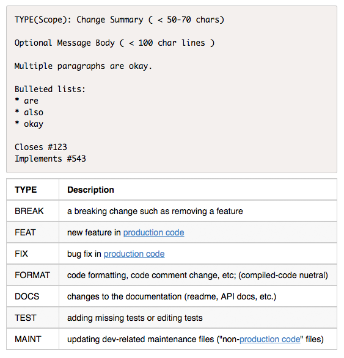

# The bluejava Git Commit Message Format Guide
*Version 0.5.1*

This is a guide to creating better Git commit messages. By following this guide, you and/or your team will create a more consistent and consistently useful change log.

Read [this blog post](http://www.bluejava.com/4Nk/The-bluejava-Git-Commit-Message-Format) for some details explaining why/how this was created.

## Commit Message Format

The format of the commit shall be composed of the following:

* A single [**Subject Line**](#subject-line) line (with [*TYPE*](#type), optional [*scope*](#scope), and a [*Summary*](#summary))
* An optional multi-line [**Message Body**](#message-body) (always preceded by a blank line)
* An optional [**Footer**](#footer) area (always preceded by a blank line)

So it looks like this:

```git
TYPE(Scope): Change Summary

Optional Message Body

Multiple paragraphs are okay.

Bulleted lists:
* are
* also
* okay

Closes #123
```

Only the top [*Subject Line*](#subject-line) with [*TYPE*](#type) and [*Summary*](#summary) is required, so a minimal commit message could look like this:

```git
TYPE: Summary
```

------------

### Subject Line

The Subject line (first line of the Commit Message) is often the only part of the commit message that displays - so it is the most critical. To make it very clear and easy to scan and filter, it shall include a [**TYPE**](#type) followed by an optional [**Scope**](#scope) (in parenthesis), followed by a colon and single space, and then a very short [**Summary**](#summary) of the change.

```git
TEST(signup): Add test for invalid user name input
```

Try to keep to a maximum of 50 characters if practical, but definitely less than 70. If you are keeping your changes "atomic" (i.e. each commit fixes a single issue or adds a single feature) then a very short summary should be possible.

#### TYPE

Every subject line starts with a TYPE – an all-caps indicator of the general category of this commit. Types include FEAT, FIX and DOCS (See [**Types**](#types) below for full list).

#### Scope

When a project is large, it is often composed of distinct subsystems or areas. The nature of this division and the names themselves are project-specific; and decided on by the author(s). The key is consistency - be sure to have a definitive list of the various scopes somewhere in the project notes so that all contributors are aware of them. Adding a new scope should be a considered decision, not just a whim when making your commit.

Often a project is divided into subdirectories or packages or modules or some other organizational unit that may naturally provide useful scopes.

Case (upper/lower) is up to the authors - again, just be consistent. When scope correlates with an existing org unit, it may be useful to use the same case as the element it corresponds to. For example, Java packages are generally all lowercase, so it is best to mimic that in the scope.

Many simpler projects will not have scopes and so this portion of the commit message will not be present. [If later the project expands and scopes start making sense, they can be introduced at that time.]

Additionally, not every commit to projects that *do* have scopes will necessarily *specify* a scope. If the commit is not limited or relevant to a single scope, leave it out.

#### Summary

The summary portion of the subject line should very succinctly describe the change. To  keep the entire subject line under 50 or 70 characters, you will need to be very brief. Use the [Message Body](#message-body) section if you feel more detail is helpful.

Use the [imperative mood](https://en.wikipedia.org/wiki/Imperative_mood), as in "Add ability to export to JSON" (not "Adding" or "Added"). An easy test for imperative mood is that your summary should complete the sentence: "Applying this patch will…" - though there is no need for perfect grammar. i.e. "Add ability…" rather than "Add the ability…" as long as it is clear.

If you are fixing a bug/issue or implementing a feature with a ticket/ID#, do NOT simply reference the # in the summary. Summary messages such as "Fix issue #123" or "Add feature #688" is not helpful. It forces a lookup of the item in question and is harder to filter by subject line. See the [**Footer**](#footer) section below for referencing issues or tickets.

---------------

### Message Body

The **Message Body** is optional - but if you wish to include it, always separate from the Subject line by a blank line. In other words, the 2nd line in your commit message should always be blank if you are making a multi-line commit.

The **Message Body** is a chance to elaborate on the change you made. Focus on the motivation and extra considerations for the change rather than detailing *what* you changed. The details of what changed can be seen in the file diff. But extra considerations such as side effects or migration hints are less obvious from the code, and could be helpful to detail here.

Continue using imperative mood, as you did in the subject line.

Multiple paragraphs can be used (separated by blank lines) for clarity/organization.

------------

### Footer

The footer area is below the [**Message body**](#message-body) (if present) or below the [**Subject Line**](#subject-line) if there is no message body. The **Footer** area should always be separated from items above it by a blank line.

The Footer is where you should reference issues or ticket numbers that the change pertains to. The format of each footer line should be specific and understood by all team members. For example:

```git
Closes #123, #456
Implements #543
```

Depending on what type of project management system you are using, these lines may vary. The goal here is to be consistent enough to programmatically query commit messages for patterns and extract data.

------------

### Types

Every commit [subject line](#subject-line) starts with a [TYPE](#type) in all CAPS and no spaces or other characters preceding it. The recognized types are:

TYPE			| Description	
:-----------|:------------
BREAK	| a breaking change such as removing a feature
FEAT	| new feature in [production code](production-code-note)
FIX		| bug fix in [production code](production-code-note)
FORMAT | code formatting, code comment change, etc; (compiled-code neutral)
DOCS | changes to the documentation (readme, API docs, etc.)
TEST | adding missing tests or editing tests
MAINT | updating dev-related maintenance files ("non-[production code](production-code-note)" files)

Often a change will include more than one type. Use the type highest on this list that applies. If desired, you can list multiple types separated by a **/**. This is generally only necessary when the types are orthogonal in nature.

For example, a new feature (FEAT type) will often also include new documentation (DOCS) and tests (TEST). In this case, simply state the type as **FEAT**.

If the change is a bugfix (FIX) that required changes to the build script (MAINT), that is less obvious and probably helpful to be stated as a multi-type change, **FIX/MAINT**.

Note the relationship between various *types* of commits and the expectation of a corresponding change in [Semantic Versioning (SemVer)](http://semver.org) version number:

- A **BREAK** commit should accompany a change in the **Major** version number.
- A **FEAT** commit should accompany a change in the **Minor** version number.
- A commit of any other type should accompany a change in the **Patch** number.

**Note:** The very first commit of a project is often the lone exception to these rules, and is conventionally "Initial Commit".

#### Production Code

Note: Use of the term *production code* here refers to any textual or binary data that compiles into or is otherwise integrated into the production system. This can include template files, JSON data files, images, style sheets, script files, SVG data, etc. This also includes configuration files if they meet this criteria.

Files that don't meet this criteria are:

- files that define the build process (package.json, grunt config, bower.json, etc.)
- files that make up an independent testing package. (Which may include code, config files, images, and all other file types that are part of production). 
- Project planning and organization files, task lists, Interface design sketches, UML diagrams, etc.
- Source assets (PSD files, AI files, etc.) that do not get processed/integrated by the build process.

--------------------------

## Examples

```git
FEAT(logger): Support JSONL log output format
```
```git
FIX: Avoid deadlocking when network drops
```
```git
TEST(crypt): Increase test coverage of crypt function
```
```git
BREAK(users): Remove getFriends API endpoint

In accordance with new privacy policy, remove the getFriends API endpoint. 
(The endpoint will continue to exist for a while and return a deprecation notice)

Implements #2105
```
```git
MAINT: add bower.json
```

## Quick Reference

Here is a little image you can drag to your desktop and popup whenever you are making a change commit:


